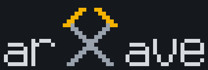

<p align="center">
  
</p>

<p align="center">
  <em>Cave dark. Gold small. Bring lamp.</em>
</p>

<p align="center">
  <a href="https://arxave.com/"><strong>Dig</strong></a> ·
  <a href="https://arxave.com/stockpile/">Stockpile</a> ·
  <a href="https://arxave.com/haul/">Haul</a> ·
  <a href="https://arxave.com/details/">Details</a>
</p>

---

## Why arXave exist

**arXiv is dark cave.** Every night mountain dump hundreds new rock at your feet.
No light. No label. You squat, you paw at pile with cold hand, you pick maybe
twenty by title. Rest go in dark forever.

**Somewhere in pile is gold.** The one paper that change what you build next
month. You walk past it. Never know. That is the real cost — not time wasted,
gold missed.

**And pile full of pyrite.** Fool's gold. Shiny, big name, big claim, look
exactly like gold in bad light. You carry it home, you spend three evening on it,
it worth nothing. Pyrite cost double: your evening, plus the real nugget you not
pick up because hand full.

**Hard part not reading. Hard part is finding.** Nugget rare, rock heavy, cave
big, night short.

arXave is lamp and sieve. It go down in cave every morning, wash whole night
pile, hold up the few stone that match *your* seam, and say out loud **why** each
one look like gold. Every rock it touch go in the bag — even one it throw back —
so nothing lost, and you can re-wash pile later when your seam change.

Two goal, only two:

1. **Never miss nugget that matter.**
2. **Bigger reading bandwidth** — more tunnel swept, same hours, less pyrite.

---

## What you can do

Four room. Same paper, same grade, four way in.

| Room | What it is | Go when |
|------|-----------|---------|
| [**Dig**](https://arxave.com/) — *new* | Filter itself, live in your tab. Say what you work on, pull tonight arXiv, watch ranking move while you tune. | You want to *set* a seam, or wash one night by hand. |
| [**Stockpile**](https://arxave.com/stockpile/) — *history* | Every night ever hauled, by month and day. Filter by seam, filter by grade. | You half-remember paper. Or want see what seam been yielding. |
| [**Haul**](https://arxave.com/haul/) — *today* | Tonight pay dirt, split by seam, as feed you point reader at. | You want paper arrive without you visiting anything. |
| [**Details**](https://arxave.com/details/) — *how it work* | What machine do, and what it refuse to do. | Before you trust ranking. |

### Three thing you actually do with it

**1. Wash tonight pile against your own work.** Open
[Dig](https://arxave.com/). Take preset closest to your
tunnel, or type your own touchstone — one thought per row, plain sentence, not
keyword. Drop few paper you already care about in **core samples** (DOI, arXiv
ID, or upload `.bib`). Hit dig. Ranking is live: move weight, ranking move under
your hand. No reload, no re-fetch, no key.

**2. Stop visiting.** Go [Haul](https://arxave.com/haul/),
take feed for your seam, paste in reader. Every morning the night pay dirt land
on desk. Count beside each seam is tonight haul, split by band, so you see how
thin a thin morning look *before* you subscribe.

**3. Find rock you half-remember.** Go
[Stockpile](https://arxave.com/stockpile/). Every night ever
run, every seam, kept *and* thrown back. Open a row and whole card come back —
same figure, same finding, same caveat it shipped with in March.

### What paper look like when arXave hold it up

Card come **folded**. First you see byline and one-line finding. That is it. Six
drawer sit under, you open only if finding earn it:

| Drawer | Inside |
|--------|--------|
| **Figure** | Paper own key figure, plus gloss saying what to look at. |
| **Asks** | Question paper set itself. |
| **Before** | How thing stood before this paper. |
| **But** | Caveat. What it not show, what author concede. |
| **Tools** | Method, hardware, codebase it lean on. |
| **Abstract** | Original abstract, untouched. |

Fold is the point. Month of open card is not page anyone scroll.

And every card carry **band**, not raw score:

| Band | Mean |
|------|------|
| **Pay dirt** | Assay was confident. Read these. |
| **Worth a look** | Over ship line, under pay-dirt line. Shipped honest, labelled honest. |
| **Long shot** | Under ship line, or night with no spread to measure. In feed because floor guarantee minimum haul — not because assay back it. |

Band sit on z-score against *that night own spread*, because grade from thin
Tuesday and fat Thursday not comparable. **"No pay dirt today" is information**,
not emptiness: mean dig ran and found nothing exceptional. Different message from
feed that look broken, so it get said out loud.

Status: browser Dig live, nightly preset feed shipping, stockpile archive
browsable, Details page up. See [`arxave-spec.md`](arxave-spec.md) for full design
and M2–M4 plan, and [`arxave-release.md`](arxave-release.md) for what shipped in
this release.

---

## Two ways to dig

| Way | Where it run | Need what |
|-----|--------------|-----------|
| **Browser sieve** | your tab, no install | nothing |
| **CLI mine** | your machine | Python 3.11, one LLM key (or local LM Studio) |

### Way 1 — browser sieve (fastest look)

Go [here](https://arxave.com/). Type touchstone. Hit dig.

Page pull today arXiv, embed abstract and your touchstone with **the pick** —
`allenai/specter2_base`, trained on citation graph, so paper that cite each other
land near each other. Rank by match. Move slider, ranking move live.

Pick run server-side, in Supabase `embed` function, so browser download nothing.
Text you want scored get sent there, embed, thrown away. Published text
(abstract, and touchstone this repo ship as preset) also go in shared cache so
nobody pay twice; **touchstone you type never go in that cache** — cache read
public, and hash of short phrase is one dictionary from phrase.

arXiv fetch also leave, through small Supabase `relay` — browser cannot fetch
arXiv direct, no CORS header.

A **claim** is one dig setup: touchstone, core, weight, gate. It save itself in
your tab, and it export as JSON — so seam is the most tradeable thing here. Take
someone claim, bend it, keep it.

For CLI config, edit `config/arxave.yaml` and `.env` by hand — see below. (There
was a browser form that wrote them for you. It fell behind the CLI and got
pulled; better no form than a form that lie.)

### Way 2 — CLI mine (full shaft)

What it is and how it differ: [The other shaft](#the-other-shaft--cli).

```bash
uv venv --python 3.11
uv pip install -e ".[dev]"

cp .env.example .env          # put ANTHROPIC_API_KEY inside
$EDITOR config/arxave.yaml     # put YOUR topics inside
```

Two thing must happen before first good run:

1. **Set topics — this is your seam.** `config/arxave.yaml` ship with fake
   example topics. Filter stage gate every rock on this list, so it is the
   biggest lever on what come out of the shaft. Dig narrow. "quantum computing"
   is not a seam, it is the whole mountain — everything come through, all of it
   pyrite.
2. **Snapshot corpus** (optional, turn on connection lines):
   ```bash
   arxave sync-corpus
   ```

Then run:

```bash
arxave run                         # whole pipeline -> briefs/<today>.md
arxave run --stage scout --dry-run # see what get fetched, write nothing
arxave run --stage summarize       # run one stage while you tune prompt
arxave render                      # re-render today brief, zero LLM call
arxave serve                       # local web UI at http://127.0.0.1:8765
```

Every stage idempotent and resumable via `status` column. Interrupt run — it
resume clean. Re-run stage — it enrich row, not duplicate row.

---

## How it work inside — the site

**No LLM in the ranking.** Grade is weighted mean of cosine. That is all.

```
haul  ->  cut  ->  centre  ->  blend  ->  gate  ->  read  ->  ship
arXiv     embed   subtract   weighted   robust    Gemini   feed +
pile      each    the cone   mean of    z, band   read     archive
          abstract axis      cosines    it        in full
```

- **haul** — night pile out of arXiv, through relay (browser cannot fetch arXiv,
  no CORS header). Publishing day, not calendar day — arXiv not announce weekend,
  so calendar lookback return nothing every Monday.
- **cut** — every abstract through **the pick**: `allenai/specter2_base`, 768-dim,
  trained on citation graph. Your touchstone go through same model. Vector cached
  and shared, keyed by model + dim + hash of text. Nightly job warm cache first,
  so haul is download, not compute.
- **centre** — **the step that make cosine mean anything.** SPECTER2 vector sit in
  narrow cone: measured over 1241 vector, mean of unit vector has norm **0.913**.
  Nine tenth of every vector point same way as every other, carry nothing about
  paper. Subtract fixed centroid, renormalise. Pairwise cosine spread go 0.137 ->
  **0.685**. Not re-ranking — ordering barely move. What change is whether
  anything downstream can *read* ordering.
- **blend** — `grade = Σ wᵣ·cos(paper, rowᵣ) / Σ wᵣ`. Weighted mean over your
  touchstone and core sample. Whole ranking function.
- **gate** — grade not comparable between night, so cut on robust z:
  `z = (grade − median) / (1.4826·MAD)`. Median and MAD, not mean and sigma, so
  one runaway paper cannot move the bar it get measured against. Ship line under
  pay-dirt line, and band say which — feed that lower unlabelled bar teach people
  stop opening it; labelled one not.
- **read** — only place LLM appear, and it appear **after** ranking. Gemini read
  the handful that clear gate, in full (arXiv HTML, not abstract), write six card
  field. Cannot promote anything. Never see paper the cosine already drop.
- **ship** — feed per seam, row per paper in archive.

Dig also **group** the night: N×N cosine matrix, average-linkage dendrogram, cut
at 0.46. Average not single linkage — single chain, one bridging paper join two
topic. Switch took one 89-stone night from 4 wagon holding 26 stone to 11 wagon
holding 63.

**Pyrite defence.** Nothing about paper except its text reach the grade. Not
venue, not author list, not institution, not how many people posting about it,
not how confident abstract sound. No citation count, no popularity term anywhere
in browser assay. Fool gold cost double — your evening, plus real nugget you not
pick up because hand full — and every one of those excluded signal is how pyrite
get picked up.

Honest cost: night with nothing for your seam come out dark, feed come out short.
That is truth about the night.

Full arithmetic, every measured constant, every date:
**[Details](https://arxave.com/details/)**.

---

## The other shaft — CLI

Different machine. LLM read and judge *every* paper, cost real money per night,
buy written brief instead of ranking you tune live. Run by hand.

```
scout  ->  summarize  ->  filter  ->  refs  ->  connect  ->  rank  ->  brief
haul       chip open      first       read      match to     weigh    hold up
the pile   each rock      sieve       the vein  your bag     stone    the gold
```

- **scout** — haul the night pile out of arXiv.
- **summarize** — small LLM chip each rock open, see what inside.
- **filter** — first sieve. Rock that miss your seam get thrown back (but still
  written down).
- **refs** — read the vein: pull each paper bibliography straight from its arXiv
  e-print source (`.bbl`), because fresh preprint not indexed anywhere else yet.
- **connect** — intersect that vein with your corpus snapshot. Where they cross
  is the brief "Connection" line.
- **rank** — weigh every surviving stone on the signals present.
- **brief** — big LLM hold up top N and argue why each look like gold.

**Two LLM role.** `light` do per-paper work (summarize, filter), run once per
scouted paper, so it eat most of cost. `heavy` write the brief, run only for top
N. Configure each one separate — provider, model, base URL, key env var. Can
point at different provider.

Scout window count publishing day here too, same reason as the site.

**Pyrite defence, CLI version.** Ranking never score a stone on shine alone. Three signal
only (`rank.py`): LLM judgment against *your* seam, citation centrality inside
*your* bag, and crowd attention — and crowd attention is saturating, so a paper
everyone shout about cannot outrank one that actually touch your work. Venue,
author fame, press release: not signals at all. Shiny rock that touch neither
seam nor bag sink.

Signal missing? Ranking renormalise over signal actually present. Paper never
score "nobody care" because a source was down.

**No runtime dep on the spin-qubit library repo.** OpenAlex client is arxave own
code (`openalex.py`). Corpus is **snapshot**, copied in by `sync-corpus`, read
from `.local/corpus/`. Library stay library. Cost is drift:
`.local/corpus/meta.json` record source and sync time, and run warn once
snapshot pass `corpus.stale_after_days`.

---

## Reading the vein: why bibliography come from arXiv, not OpenAlex

First try was OpenAlex: resolve each paper arXiv DOI, take its reference list.
**Dead end for fresh preprint.** Two reason, both measured against live API
2026-07-20:

1. **Index lag.** 61 papers scouted that morning. Sample of 12 resolved in
   OpenAlex **0 times**. Same-day preprint simply not there.
2. **Preprint record carry no reference list.** Even when arXiv DOI resolve,
   record is stub — reference live on the record for the *published* version,
   different DOI. Measured: arXiv:2112.08863 ("Semiconductor Spin Qubits")
   resolve to `W4320341678` with **0** references, while Rev. Mod. Phys. record
   for same paper, `W4380590907`, have **664**.

Fix: paper **ship own bibliography inside its LaTeX source**. `refs` stage pull
the e-print tarball, parse `.bbl`/`.bib`, match against corpus. Zero index lag —
work on day-one preprint, which is exactly the paper arXave care about. OpenAlex
now only fallback, for paper the `.bbl` route not connect.

Brief still written so it read correct when no connection exist: model must say
which of your topics the paper touch, and is forbidden to claim paper
disconnected from your library. Missing reference list is artifact of index, not
fact about paper.

---

## Your bag of stone

`papers.db` is the bag. Every rock the pipeline touch go in it — kept one *and*
thrown-back one, with the score that decided which. So:

- Change your seam later, re-wash old pile. No re-fetch, no re-pay.
- Stone you threw back is still on record. "Did I see this in March?" — bag know.
- `arxave render` rebuild any past brief from the bag with zero LLM call.

Full run prune on rolling window (`retention.days`); `--stage` run never prune,
so re-running one step stay non-destructive.

**Trading is the point.** Bag only worth so much alone. Real gain come when
miner open bag to miner: swap stone, compare seam, catch nugget from tunnel you
never dug. Shared store is the M4 target — one nightly run feeding a shared
Supabase, text only. Not built yet.

---

## Still to build

**Browser sieve — mesh not finished**

- **Corpus signal** — WIP, title only. Need full abstract embeddings.
- **Crowd attention** — Scirate behind bot challenge. Need other source.
- **Citation overlap** — need backend, not browser.
- **LLM refine step** — not wired yet.

Those slider sit disabled until signal real. Ranking renormalise over signal
actually present, so missing signal redistribute weight instead of scoring paper
"nobody care".

**Deeper shaft (spec M2–M4)**

- **M2 — graph merge.** `link.py` + `oa_fetch` refactor. New rock enter rebuilt
  graph, connection line and centrality signal go live.
- **M3 — semantic layer + real scites.** Real scites in ranking (`scirate.py`
  today is stub returning `None`). Embeddings for "related but uncited" and
  "sciting but unseen" — nugget sitting next to your seam that cite nobody you
  know. Citation route cannot see those at all.
- **M4 — live + scheduled + trading post.** Brief as refreshing artifact, nightly
  scheduled run, shared store so miner swap bag.

**Open question** (spec §11)

- Cite-key scheme — collision-proof convention, needed before first ingest.
- De-duplication — preprint later published get new DOI. Need merge rule so
  arXiv v1 and journal version not become two node.
- Ranking weight — hand-tuned now. Worth logging read feedback to learn them.

---

## Edge functions

Two Supabase function back the browser page. Both public, no auth — page is
static, no session.

| Function | Why |
|----------|-----|
| `relay` | arXiv and Scirate send **no** CORS header. Browser cannot fetch them at all. This relay the GET server-side, allowlisted to those host. |
| `embed` | The pick. Run server-side so browser download no model. Text sent get embedded and thrown away; published text also land in shared cache, text you typed never do. |

Deploy step and cost cap: [`supabase/functions/README.md`](supabase/functions/README.md).

---

## Tests

```bash
uv run pytest             # Python: pipeline, ranking, storage
cd scripts && node --test  # Node: warmer, feed builder, enricher, demath
```

No network, no API key, no fixture outside `tmp_path`.
